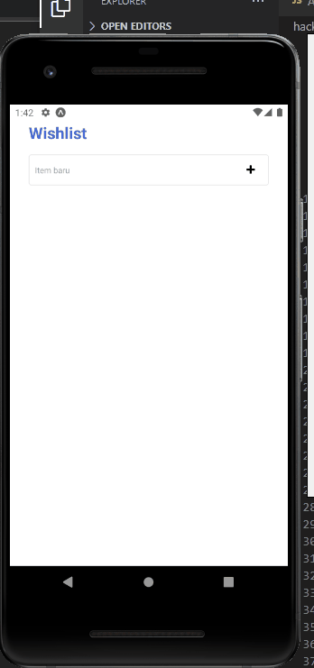

# Simple Wishlist App

## Demo

 

## Run project

In the project directory, you can run:

### `npm start`
### `npm run android`

or

### `expo start`

 

You can run this project on an iOS device. First install the required library globally on your computer:
### `npm install -g ios-deploy`

