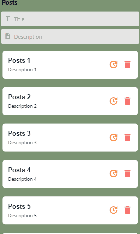

# Component Data Flow & Lifecycle Methods

## Demo

 
 

## Run project

In the project directory, you can run:

### `json-server --host [your local IP address] db.json`

### `expo start`

### `expo start --android`

### `expo start --web`
